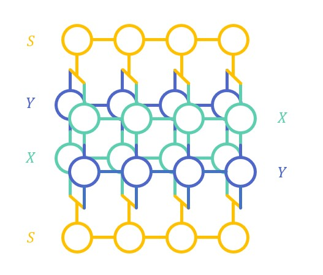

# Matrix Product


Importation 
```python
from syngular.tensor.tensor_train import MatrixProductState
from syngular.tensor.tensor_train import MatrixProductOperator
```

### Addition

```python
tensor = np.arange(0,16).reshape((2,2,2,2))

X = MatrixProductOperator(tensor, bond_shape=(4,))
Y = MatrixProductOperator(tensor, bond_shape=(4,))

Z = X + Y
```

### Multiplication

```python
tensor = np.arange(0,16).reshape((2,2,2,2))
tensor2 = np.arange(0,4).reshape((2,2))

X = MatrixProductOperator(tensor, bond_shape=(4,))
Y = MatrixProductOperator(tensor, bond_shape=(4,))
Z = MatrixProductOperator(tensor, bond_shape=(4,))
S = MatrixProductState(tensor2, bond_shape=(4,))

W = S @ ((X @ Y) + (Y @ X)) @ S
```



### Compression


```python
tensor = np.arange(0,16).reshape((2,2,2,2))

X = MatrixProductOperator(tensor, bond_shape=(4,))

W = X >> 2
```
